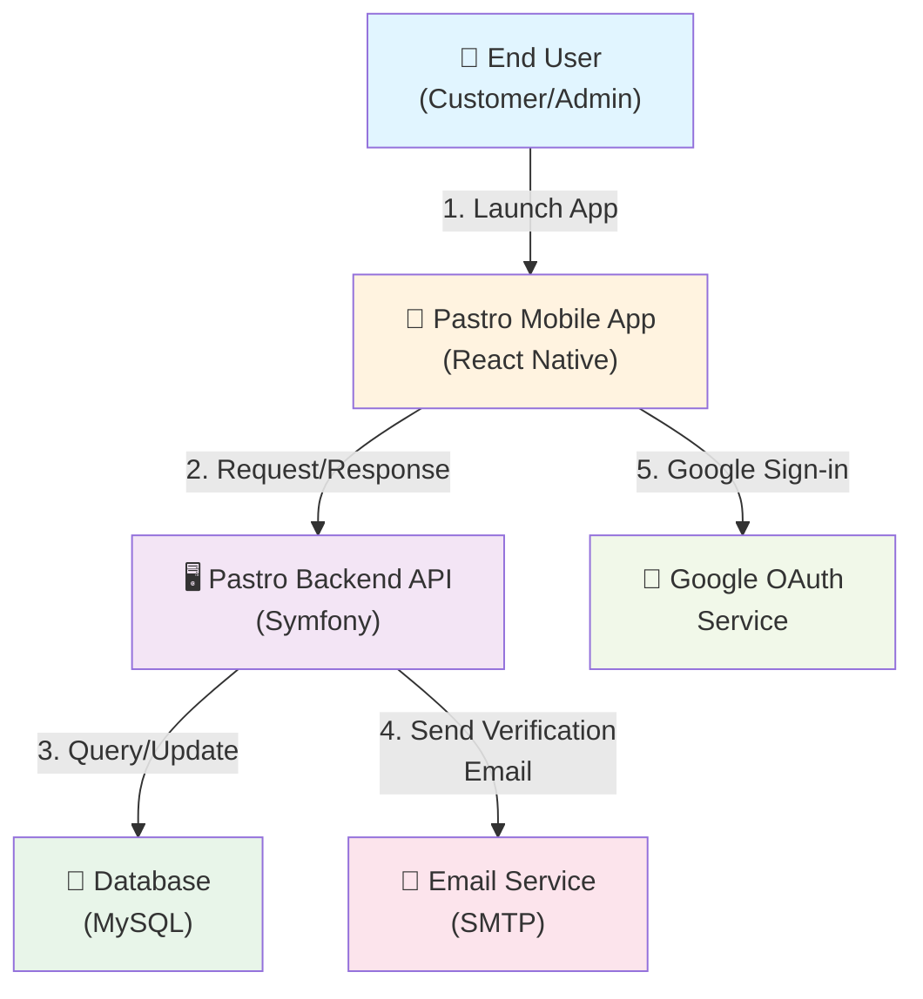
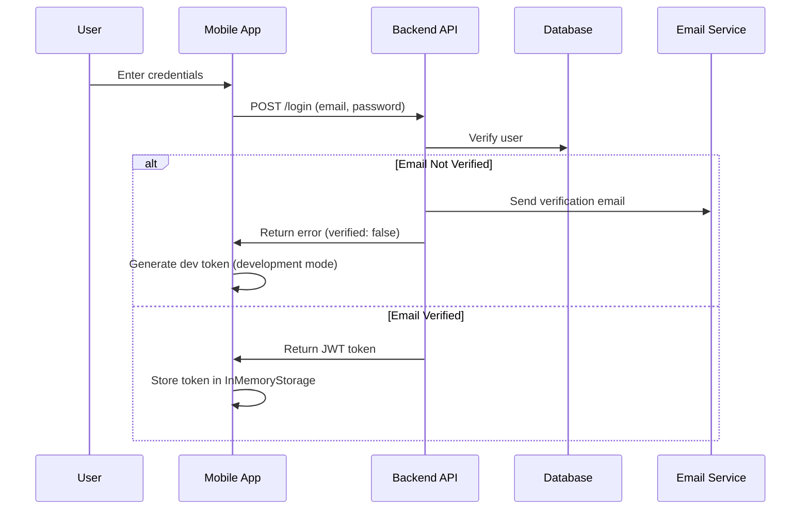
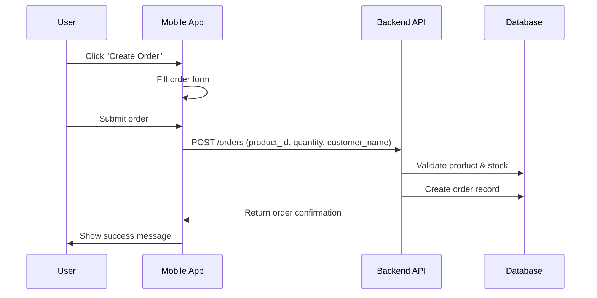
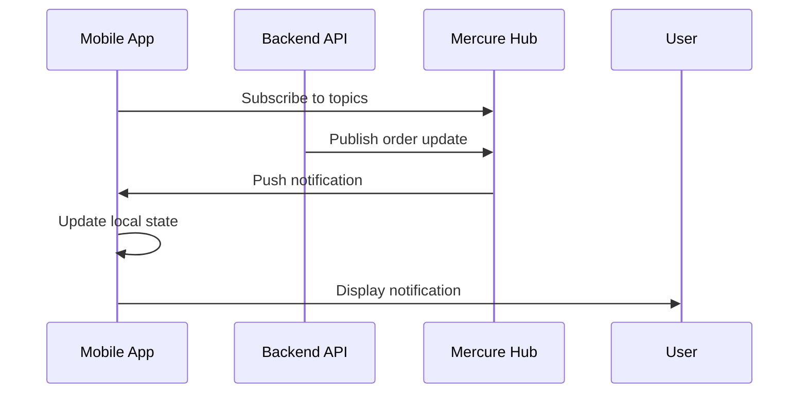

# Data Flow Diagram - Level 1 (Context Diagram)

## Pastro Mobile Application - System Context



## Data Flow Elements

### External Entities
| Entity | Type | Description |
|--------|------|-------------|
| End User | External Actor | Customer interacting with mobile app |
| Database | External Data Store | Persistent storage for users, products, orders |
| Email Service | External System | Sends verification emails and notifications |
| Google OAuth | External Service | Authentication provider for social login |

### Major Data Flows

#### Flow 1: User Authentication
- **Source:** Mobile App
- **Destination:** Backend API
- **Data:** Email, Password
- **Process:** Login/Registration validation

#### Flow 2: Product Browsing
- **Source:** Mobile App
- **Destination:** Backend API
- **Data:** Product list, Stock information
- **Process:** Retrieve available products

#### Flow 3: Order Creation
- **Source:** Mobile App
- **Destination:** Backend API
- **Data:** Product ID, Quantity, Customer Name, Material, Color
- **Process:** Create new order, validate inventory

#### Flow 4: Order Management
- **Source:** Mobile App
- **Destination:** Backend API
- **Data:** Order status, Order details
- **Process:** Retrieve orders, update order status

#### Flow 5: Real-time Updates
- **Source:** Backend API
- **Destination:** Mobile App
- **Data:** Order status changes, Notifications
- **Process:** Mercure WebSocket subscription for live updates

#### Flow 6: Email Verification
- **Source:** Backend API
- **Destination:** Email Service
- **Data:** User email, Verification token
- **Process:** Send verification email to new users

---

## System Boundaries

### Within System
- Mobile application logic
- Redux state management
- Local in-memory storage
- API request/response handling
- Authentication management

### Outside System
- Backend API (external microservice)
- Database storage
- Email sending service
- Google authentication service
- Network communication

---

## Key Processes (Level 0)

1. **User Authentication** - Login, Register, Logout
2. **Product Management** - Browse products, view details, check stock
3. **Order Management** - Create orders, view orders, track status
4. **Real-time Notifications** - Mercure WebSocket for live updates
5. **User Profile Management** - View/edit profile information

---

## Technology Stack Integration

```
┌─────────────────────────────────────────────────────────┐
│              PASTRO MOBILE APPLICATION                  │
├─────────────────────────────────────────────────────────┤
│  UI Layer (React Native + React Native Paper)           │
│  State Management (Redux + Redux-Saga)                  │
│  Local Storage (InMemoryStorage)                        │
│  HTTP Client (Axios)                                    │
│  Real-time (Mercure WebSocket)                          │
├─────────────────────────────────────────────────────────┤
│                    NETWORK LAYER                         │
├─────────────────────────────────────────────────────────┤
│  Backend: Symfony API                                   │
│  URL: https://finalwebdev-production.up.railway.app    │
│  Authentication: JWT Bearer Tokens                      │
├─────────────────────────────────────────────────────────┤
│                   DATA LAYER                            │
├─────────────────────────────────────────────────────────┤
│  MySQL Database                                         │
│  Tables: Users, Products, Orders, Stock                │
└─────────────────────────────────────────────────────────┘
```

---

## Authentication Flow



---

## Order Creation Flow



---

## Real-time Update Flow


